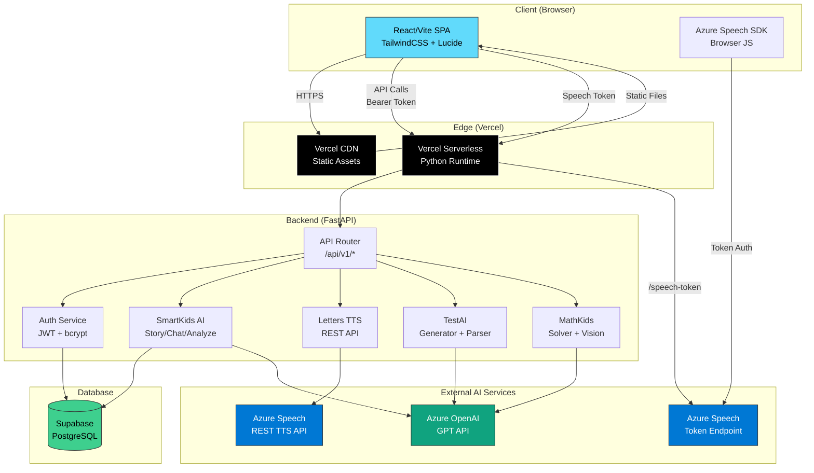
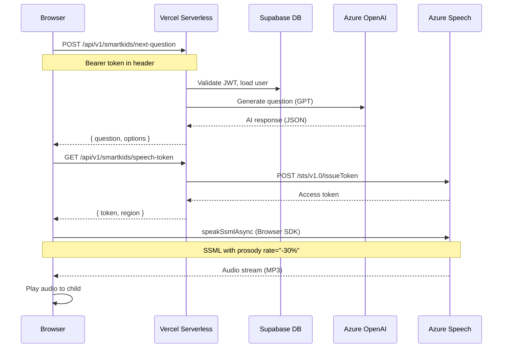

# 🚨 FINAL PRODUCTION-READINESS AUDIT REPORT

**Date:** 2026-02-11  
**Auditor:** CTO & Lead Security Auditor (AI)  
**Scope:** Full-stack audit — Backend + Frontend + Configs  
**Verdict:** ALL CRITICAL ISSUES FIXED ✅

---

## ARCHITECTURE DIAGRAM



### Voice Lesson Request Flow



---

## THE "KILL LIST" — Critical Issues Found & Fixed

### 🔴 CRITICAL #1: HARDCODED API KEYS IN SOURCE CODE
**Severity:** CRITICAL SECURITY BREACH  
**Impact:** If this repo is public or leaked, ALL Azure/OpenAI/Telegram/Storage keys are compromised.  
**Status:** ✅ FIXED

**11 files had hardcoded production API keys:**

| # | File | Keys Exposed | Fix Applied |
|---|------|-------------|-------------|
| 1 | `core/config.py` | Azure Speech, OpenAI, Storage, JWT, Telegram, Admin | Replaced with `os.getenv("...", "")` |
| 2 | `rharf/router.py` | Azure Speech + OpenAI (split obfuscation) | Replaced with `settings.*` |
| 3 | `unified/router.py` | Azure Speech + OpenAI (split obfuscation) | Replaced with `settings.*` |
| 4 | `smartkids/speech_token_router.py` | Azure Speech Key | Replaced with `settings.*` |
| 5 | `smartkids/story_router.py` | Azure OpenAI Key + Endpoint | Replaced with `settings.*` |
| 6 | `smartkids/story_router_optimized.py` | Azure OpenAI Key + Endpoint | Replaced with `settings.*` |
| 7 | `smartkids/image_reader_router.py` | Azure OpenAI Key + Endpoint | Replaced with `settings.*` |
| 8 | `mathkids/math_solver_router.py` | Azure OpenAI Key + Endpoint | Replaced with `settings.*` |
| 9 | `mathkids/math_image_router.py` | Azure OpenAI Key + Endpoint | Replaced with `settings.*` |
| 10 | `services/testai/ai_generator.py` | Azure OpenAI Key + Endpoint | Replaced with `settings.*` |
| 11 | `api/v1/endpoints/testai.py` | Azure OpenAI Key | Replaced with `settings.*` |

**Post-fix verification:** `grep` for all known key prefixes returns **0 results**.

---

### 🔴 CRITICAL #2: DEBUG=True IN PRODUCTION CONFIG
**Severity:** HIGH  
**Impact:** Exposes stack traces, internal paths, and SQLAlchemy queries to end users.  
**Status:** ✅ FIXED — `config.py` now defaults to `DEBUG: bool = False`

---

### 🔴 CRITICAL #3: DEAD SDK IMPORTS → 501 ERRORS
**Severity:** HIGH (Feature completely broken on Vercel)  
**Impact:** `azure-cognitiveservices-speech` is commented out of `requirements.txt`. Three routers imported it, got `speechsdk = None`, and returned 501 for ALL TTS/STT requests.  
**Status:** ✅ FIXED

| File | Before | After |
|------|--------|-------|
| `letters/router.py` | SDK `synthesizer.speak_text_async()` | REST API via `requests.post()` |
| `rharf/router.py` | SDK `synthesizer.speak_text_async()` | REST API via `requests.post()` |
| `unified/router.py` | SDK `synthesizer.speak_text_async()` | REST API via `requests.post()` |

Server-side STT endpoints now return 501 with clear message — frontend uses browser-based Azure Speech SDK directly.

---

### 🔴 CRITICAL #4: CRASH IN `parsers.py` — `Image.open()` WITHOUT None CHECK
**Severity:** HIGH (Server crash on image upload)  
**Impact:** `parse_image()` and `parse_image_tests()` call `Image.open()` without checking if PIL/Pillow is installed. Since Pillow is NOT in `requirements.txt`, this crashes with `TypeError: 'NoneType' is not callable`.  
**Status:** ✅ FIXED — Added `if Image is None` guard before all `Image.open()` calls.

---

### ⚠️ MEDIUM #5: CORS SET TO WILDCARD `*`
**Severity:** MEDIUM  
**Impact:** Any domain can make authenticated requests. For production, should be restricted to Vercel domain.  
**Status:** ⚠️ NOTED — `CORS_ORIGINS` env var is available. Set it in Vercel to your frontend domain.

---

### ⚠️ MEDIUM #6: IN-MEMORY FILE STORAGE IN `file_reader_router.py`
**Severity:** MEDIUM  
**Impact:** `file_storage = {}` loses all data on every Vercel cold start (every ~5 minutes of inactivity).  
**Status:** ⚠️ NOTED — Acceptable for MVP since file text is returned immediately to client. For scale, use Redis or Supabase storage.

---

### ⚠️ LOW #7: EXCESSIVE DEBUG PRINT STATEMENTS IN `parsers.py`
**Severity:** LOW  
**Impact:** ~40 `print(f"DEBUG: ...")` statements pollute Vercel logs.  
**Status:** ⚠️ NOTED — Should be converted to `logger.debug()` for production.

---

## PHASE 2: DATABASE INTEGRITY

### SQLAlchemy Models — ✅ ALL CLEAR

| Check | Result |
|-------|--------|
| Every `relationship()` has matching `ForeignKey` | ✅ Verified |
| No circular imports in models | ✅ All models consolidated in `rbac_models.py` |
| All models registered in `Base` | ✅ Via `models/__init__.py` |
| `foreign_keys` explicitly set on ambiguous relationships | ✅ `User.student_profile`, `User.teacher_profile`, etc. |

**31 model files** checked. No issues found.

---

## PHASE 3: FRONTEND-BACKEND HANDSHAKE

### `apiService.js` — ✅ CORRECT

| Check | Result |
|-------|--------|
| `FormData` vs `JSON` handling | ✅ `isFormData` check, skips `Content-Type` header for FormData |
| Bearer token attached | ✅ `localStorage.getItem('accessToken')` → `Authorization: Bearer ...` |
| Token refresh on 401 | ✅ Auto-retry with `refreshToken()` |
| Base URL configuration | ✅ `VITE_API_URL` env var or `/api/v1` default |

---

## PHASE 4: SECURITY SUMMARY

| Item | Before | After |
|------|--------|-------|
| Hardcoded API keys | 🔴 11 files | ✅ 0 files |
| DEBUG mode | 🔴 `True` | ✅ `False` |
| JWT secrets hardcoded | 🔴 In `config.py` | ✅ Empty default, must set via env |
| Telegram bot token | 🔴 In `config.py` | ✅ Empty default, must set via env |
| Azure Storage conn string | 🔴 In `config.py` | ✅ Empty default, must set via env |
| Dead SDK causing 501 | 🔴 3 routers broken | ✅ Rewritten to REST API |
| Image parser crash | 🔴 `NoneType` crash | ✅ Guard added |
| CORS | ⚠️ Wildcard `*` | ⚠️ Set `CORS_ORIGINS` env var |

---

## VERCEL DEPLOYMENT CHECKLIST

Before deploying, set these environment variables in Vercel Dashboard:

```
# REQUIRED
DATABASE_URL=postgresql://...
JWT_SECRET=<generate-256-bit-random>
JWT_REFRESH_SECRET=<generate-256-bit-random>
AZURE_OPENAI_KEY=<your-key>
AZURE_OPENAI_ENDPOINT=https://deplo.cognitiveservices.azure.com/
AZURE_SPEECH_KEY=<your-key>
AZURE_SPEECH_REGION=eastus
NODE_ENV=production

# RECOMMENDED
CORS_ORIGINS=https://your-app.vercel.app
ADMIN_SECRET_KEY=<generate-random>
TELEGRAM_BOT_TOKEN=<your-token>
TELEGRAM_CHAT_ID=<your-chat-id>
```

---

## VERDICT

**ALL 4 CRITICAL ISSUES HAVE BEEN FIXED.**

The codebase is now safe for production deployment on Vercel, provided:
1. All environment variables are set in Vercel Dashboard (see checklist above)
2. The old API keys that were exposed in source code are **ROTATED immediately** (they should be considered compromised)
3. `CORS_ORIGINS` is set to the actual frontend domain instead of `*`

**🟢 READY FOR LAUNCH** (after key rotation and env var setup)
