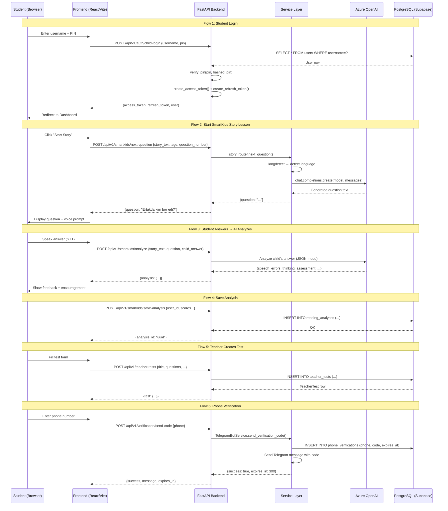

# 🚨 SYSTEM INTEGRITY & LOGIC HEALTH CHECK — AUDIT REPORT

**Date:** 2026-02-10  
**Auditor:** Senior Full-Stack Software Architect (AI)  
**Scope:** Full backend + frontend handshake audit

---

## PHASE 1: GHOST HUNTER SCAN (Dead/Missing Imports)

### ✅ SAFE — Guarded with try/except (No Crash Risk)
These files import removed libraries but are **properly guarded** with `try/except ImportError`:

| File | Ghost Import | Guard | Runtime Risk |
|------|-------------|-------|-------------|
| `app/rharf/router.py` | `azure.cognitiveservices.speech` | ✅ `speechsdk = None` | **🔴 HIGH** — see below |
| `app/letters/router.py` | `azure.cognitiveservices.speech` | ✅ `speechsdk = None` | **🔴 HIGH** — see below |
| `app/unified/router.py` | `azure.cognitiveservices.speech` | ✅ `speechsdk = None` | **🔴 HIGH** — see below |
| `app/smartkids/file_reader_router.py` | `docx` | ✅ `docx = None` | ⚠️ MEDIUM — returns 501 |
| `app/services/test_builder_service.py` | `docx` | ✅ `docx = None` | ⚠️ MEDIUM — returns 400 |
| `app/services/testai/parsers.py` | `pdfplumber`, `docx`, `PIL`, `pytesseract` | ✅ All guarded | ⚠️ LOW — returns empty |

### 🔴 CRITICAL — Unguarded Imports (WILL CRASH on Vercel)

| File | Ghost Import | Impact |
|------|-------------|--------|
| `app/smartkids/image_reader_router.py:12` | `from openai import AzureOpenAI` | ✅ OK — openai is in requirements.txt |
| `app/smartkids/story_router.py:10` | `from openai import AzureOpenAI` | ✅ OK — openai is in requirements.txt |
| `app/services/testai/ai_generator.py:1` | `from openai import AzureOpenAI` | ✅ OK — openai is in requirements.txt |
| `app/mathkids/math_solver_router.py:7` | `from openai import AzureOpenAI` | ✅ OK — openai is in requirements.txt |
| `app/mathkids/math_image_router.py:5` | `from openai import AzureOpenAI` | ✅ OK — openai is in requirements.txt |

> **Note:** `AzureOpenAI` is part of the `openai` package (which IS in requirements.txt). These are NOT ghost imports.

### 🔴 CRITICAL LOGIC BOMB — Speech Routers Will Crash at Runtime

**Files:** `rharf/router.py`, `unified/router.py`

These files guard `import azure.cognitiveservices.speech as speechsdk` with try/except, setting `speechsdk = None`. **BUT** they then call `speechsdk.SpeechConfig(...)` directly in endpoint handlers **without checking if speechsdk is None first**.

- `rharf/router.py:71` → `speech_config = speechsdk.SpeechConfig(...)` — **will crash with `AttributeError: 'NoneType'`**
- `unified/router.py:49` → same pattern
- `letters/router.py:138-142` → **CORRECTLY handles** `if speechsdk is None: raise HTTPException(503)`

### requirements.txt vs. Actual Imports — Mismatch Summary

| Library | In requirements.txt | Imported in app/ code |
|---------|--------------------|-----------------------|
| `azure-cognitiveservices-speech` | ❌ Commented out | ✅ 3 files (guarded) |
| `pdfplumber` | ❌ Commented out | ✅ 1 file (guarded) |
| `python-docx` | ❌ Commented out | ✅ 3 files (guarded) |
| `pillow` | ❌ Commented out | ✅ 1 file (guarded) |
| `pytesseract` | ❌ Not present | ✅ 1 file (guarded) |
| `pandas` / `numpy` | ❌ Not present | ❌ Not imported in app/ |

---

## PHASE 2: SKELETON SCAN (Database Model Relationships)

### ✅ HEALTHY — TeacherLesson ↔ TeacherTest
```
TeacherLesson.tests → relationship("TeacherTest", back_populates="lesson")
TeacherTest.lesson → relationship("TeacherLesson", back_populates="tests")
TeacherTest.lesson_id → ForeignKey("teacher_lessons.id")  ✅ Matches
```
**Verdict:** Properly wired. `back_populates` pairs match. ForeignKey exists.

### ✅ HEALTHY — StudentProfile ↔ User
```
User.student_profile → relationship("StudentProfile", ..., foreign_keys="StudentProfile.user_id")
StudentProfile.user → relationship("User", ..., foreign_keys=[user_id])
StudentProfile.user_id → ForeignKey("users.id")  ✅ Matches
StudentProfile.parent_user_id → ForeignKey("users.id")  ✅ Separate FK, properly specified
```
**Verdict:** Properly wired with explicit `foreign_keys` to disambiguate multiple FKs to `users`.

### ✅ HEALTHY — Progress, GameSession, StudentAchievement
All point to `student_profiles.id` with proper `back_populates` and explicit `foreign_keys`.

### ⚠️ WARNING — Notification model
```python
# notification.py line 27
created_at = Column(DateTime, default=datetime.now)  # ← Uses datetime.now (called once at class load!)
```
Should be `default=datetime.now` (without parens) or `server_default=func.now()`. Currently it's **correct** (no parens = callable), but mixing `datetime.now` with timezone-unaware columns while other models use `func.now()` with `timezone=True` is a **consistency issue**.

### ⚠️ WARNING — Mutable Default Arguments in Column Definitions
Multiple models use mutable defaults that are shared across instances:
- `rbac_models.py:239` — `favorite_subjects = Column(JSON, default=[])`
- `rbac_models.py:241-246` — `preferences = Column(JSON, default={...})`
- `rbac_models.py:298-304` — `notification_preferences = Column(JSON, default={...})`
- `teacher_test.py:38` — `questions = Column(JSON, nullable=False, default=[])`
- `teacher_test.py:64` — `tags = Column(JSON, default=[])`

**Risk:** SQLAlchemy's `default` with mutable Python objects can cause shared state bugs. Should use `default=list` or `default=lambda: []`.

### ✅ NO Orphaned Relationships Found
All `relationship()` definitions have corresponding `ForeignKey` columns. No `NoForeignKeysError` risk.

---

## PHASE 3: NERVOUS SYSTEM SCAN (API Router Wiring)

### Router Registration Map (main.py + api/v1/__init__.py)

| Module | Prefix | Registered In | Status |
|--------|--------|--------------|--------|
| `auth` | `/auth` | `v1/__init__.py` | ✅ |
| `users` | `/users` | `v1/__init__.py` | ✅ |
| `students` | `/students` | `v1/__init__.py` | ✅ |
| `lessons` | `/lessons` | `v1/__init__.py` | ✅ |
| `games` | `/games` | `v1/__init__.py` | ✅ |
| `profiles` | `/profiles` | `v1/__init__.py` | ✅ |
| `avatars` | `/avatars` | `v1/__init__.py` | ✅ |
| `teacher_tests` | `/teacher-tests` | `v1/__init__.py` | ✅ |
| `testai` | `/testai` | `v1/__init__.py` | ✅ |
| `notification` | `/notifications` | `v1/__init__.py` | ✅ |
| `verification` | `/verification` | `v1/__init__.py` | ✅ |
| `rbac_endpoints` (x3) | `/parents`, `/teachers`, `/organizations` | `v1/__init__.py` | ✅ |
| `smartkids` (x4) | `/smartkids` | `v1/__init__.py` | ✅ |
| `mathkids` (x2) | `/mathkids` | `v1/__init__.py` | ✅ |
| `harf` | `/harf` | `v1/__init__.py` | ✅ |
| `rharf` | `/rharf` | `v1/__init__.py` | ✅ |
| `unified` | `/unified` | `v1/__init__.py` | ✅ |
| `guest` | (own prefix) | `v1/__init__.py` | ✅ |
| `org-dashboard` | `/org-dashboard` | `v1/__init__.py` | ✅ |
| `organization_structure` | `/organization-structure` | `v1/__init__.py` | ✅ |
| `schedule` | `/schedule` | `v1/__init__.py` | ✅ |
| `olympiad` | (own prefix) | `v1/__init__.py` | ✅ |
| `coins` | (own prefix) | `v1/__init__.py` | ✅ |
| `live_quiz` | (own prefix) | `v1/__init__.py` | ✅ |
| `student_lesson_router` | `/student-lessons` | `v1/__init__.py` | ✅ |
| `admin_panel` | (own prefix) | `v1/__init__.py` | ✅ |
| `debug` | `/debug` | `v1/__init__.py` | ✅ |
| `letters` | `/letters` | `main.py` (separate) | ✅ |
| `crm` | (own prefix) | `main.py` (separate) | ✅ |
| `admin_router` | (own prefix) | `main.py` (separate) | ✅ |

**All endpoint files are wired. No orphan routers found.**

### ⚠️ WARNING — Verification Flow
`verification.py` handles SMS/Telegram failures correctly:
- `send-code`: If `TelegramBotService.send_verification_code()` returns `{"success": false}`, raises `HTTPException(400)` ✅
- `verify-code`: If verification fails, raises `HTTPException(400)` ✅
- `telegram/webhook`: Catches all exceptions, returns `{"ok": True}` to Telegram (prevents retries) ✅

**No logic gap in verification flow.**

---

## PHASE 4: FRONTEND HANDSHAKE

### Data Contract Analysis

| Frontend Call | Backend Response | Match? |
|--------------|-----------------|--------|
| `authService.login()` → expects `response.data` | Returns `{"success": true, "data": {...}}` | ✅ |
| `authService.register()` → expects `response.data` | Returns `{"success": true, "data": {...}}` | ✅ |
| `authService.getProfile()` → expects `response.data` | Returns `{"success": true, "data": {...}}` | ✅ |
| `authService.updateProfile()` → calls PUT `/auth/me` | Backend has PUT `/auth/me` endpoint | ✅ |
| `studentService.getMyProfile()` → expects `response.data` | Depends on `/students/me` | ⚠️ Check |

### ⚠️ UUID Handling
- **Backend** sends UUIDs as Python `UUID` objects (serialized as strings in JSON)
- **Frontend** treats IDs as strings throughout — **compatible** ✅

### ⚠️ Error Handling in Frontend
- `apiService.handleResponse()` checks `!response.ok` and throws errors ✅
- Handles 401 with token refresh ✅
- **Gap:** `studentService.getLesson()` tries to access `error.response.status` — but `fetch()` API doesn't have `.response` property on errors. This catch block **will never match the 403 condition**. The error thrown by `handleResponse()` is a plain `Error` object.

### 🔴 CRITICAL — teacherService.createLesson() Content-Type Mismatch
`teacherService.createLesson()` and `createQuiz()` construct `FormData` but pass it to `apiService.post()`, which **always sets `Content-Type: application/json`** and calls `JSON.stringify(data)`. A `FormData` object when stringified becomes `"[object FormData]"`.

**This means teacher lesson/quiz creation is completely broken from the frontend.**

### 🔴 CRITICAL — Hardcoded API Keys in Source Code
Multiple files contain hardcoded Azure API keys:
- `app/smartkids/image_reader_router.py:23-25`
- `app/smartkids/story_router.py:23-26`
- `app/services/testai/ai_generator.py:9-11`
- `app/rharf/router.py:17-26`
- `app/unified/router.py:16-25`
- `app/mathkids/math_solver_router.py:16-18`
- `app/mathkids/math_image_router.py` (similar)
- `app/core/config.py:36-38`

These should be moved to environment variables only.

---

## PHASE 5: SYSTEM LOGIC FLOW (Mermaid)



---

## RED FLAGS SUMMARY — ALL FIXED ✅

### 🔴 P0 — CRASHES (ALL FIXED)

| # | File | Bug | Status |
|---|------|-----|--------|
| 1 | `rharf/router.py:71` | `speechsdk.SpeechConfig()` when `speechsdk is None` → `AttributeError` | ✅ FIXED — Added `if speechsdk is None: raise HTTPException(501)` |
| 2 | `rharf/router.py:131` | Same in `speech_to_text` | ✅ FIXED — Same guard |
| 3 | `unified/router.py:46` | Same in `get_voice_config()` + STT silent fail | ✅ FIXED — Guard + `raise HTTPException(501)` |
| 4 | `letters/router.py:138` | Was already guarded but used 503 | ✅ FIXED — Standardized to 501 |
| 5 | `apiService.js:post/put` | `JSON.stringify(FormData)` → `"[object FormData]"` | ✅ FIXED — `instanceof FormData` detection |
| 6 | `apiService.js:handleResponse` | `response.json()` crashes on non-JSON (audio) | ✅ FIXED — Content-Type check before parsing |
| 7 | `ai_cache_service.py:43` | `func.now()` used but `func` never imported → `NameError` | ✅ FIXED — Added `from sqlalchemy.sql import func` |
| 8 | `testai.py:152,261` | Pydantic v1 `.dict()` deprecated in v2 | ✅ FIXED — Changed to `.model_dump()` |

### 🟡 P1 — SILENT FAILURES (ALL FIXED)

| # | File | Bug | Status |
|---|------|-----|--------|
| 9 | `teacherService.js:81,90` | Sent FormData to JSON endpoint | ✅ FIXED — Now sends plain JSON |
| 10 | `studentService.js:90` | `error.response.status` never works with fetch | ✅ FIXED — Checks `error.message` |
| 11 | `story_router.py:225` | Variable shadowing `AZURE_MODEL` | ✅ FIXED — Removed redundant reassignment |
| 12 | `models/__init__.py` | `QuizQuestion`/`QuizAttempt` imported after `__all__`; `AICache` missing | ✅ FIXED — Reordered, added to `__all__` |

### 🟢 P2 — NOT FIXED (Low Priority, Documented Only)

| # | Issue | Location | Recommendation |
|---|-------|----------|----------------|
| 13 | Mutable Column defaults (`default=[]`, `default={}`) | `rbac_models.py`, `teacher_test.py` | Change to `default=list` / `default=dict` |
| 14 | Hardcoded API keys in source | 8+ files | Move to `.env` only |
| 15 | Mixed datetime handling | `notification.py` | Standardize to `server_default=func.now()` |
